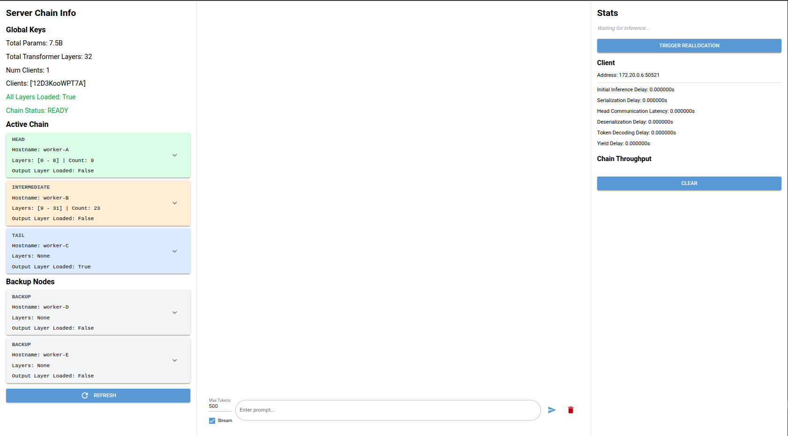
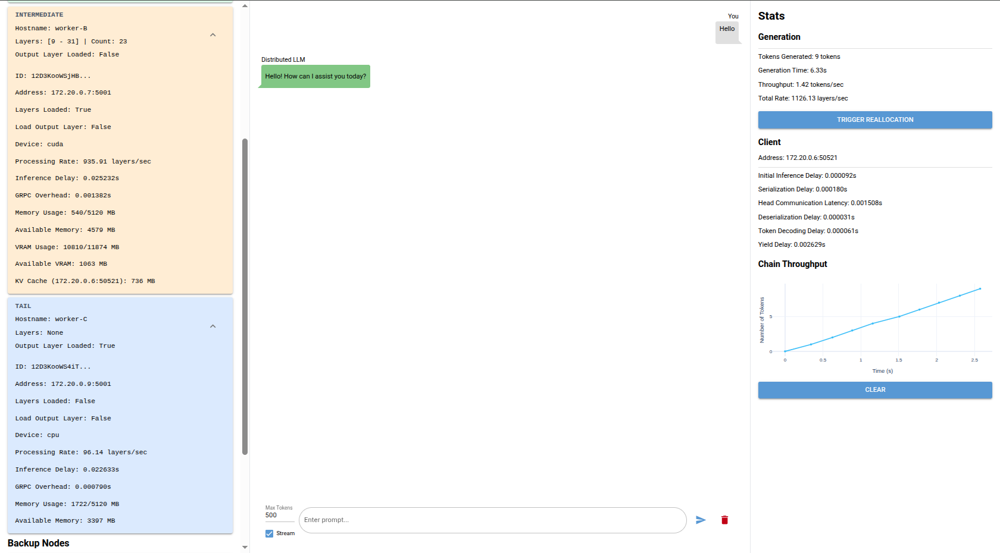

***

# Dynamic and Fault-Tolerant Collaborative LLM Inference

This project implements a dynamic, fault-tolerant system for collaborative Large Language Model (LLM) inference across a local network of heterogeneous devices. By leveraging pipeline parallelism, the system distributes the transformer layers and the final output layer of an LLM across multiple worker nodes.

## System Architecture: Node Types

The decentralized network is composed of three distinct types of nodes:

- **Client Nodes:** The user-facing entry points. Clients require minimal computational resources, as they only handle prompt tokenization and the initial embedding layer before forwarding the request to the server chain.
- **Active Server Nodes:** The core computational workers. These nodes form the active inference chain by loading specific sequences of the LLM's transformer layers and/or the final output layer to collaboratively process the generation.
- **Backup Server Nodes:** Idle reserve workers. They continuously monitor the active chain and automatically step in to replace failed nodes or take over for slower active nodes to maximize overall throughput.

## System Requirements

- **Operating System:** Linux only. The `hivemind` library used for decentralized coordination is not currently supported on Windows.
- **Hardware:** CPU execution is supported, but GPU acceleration requires an **NVIDIA GPU with CUDA**.

## Key Features

* **Decentralized Coordination:** System coordination is managed by a Distributed Hash Table (DHT), eliminating the need for a centralized coordinator node and preventing single points of failure.
* **Dynamic Load Balancing:** Ensures automatic load balancing through the dynamic reallocation of model layers based on real-time processing rates and memory constraints.
* **Fault Tolerance:** Automatically repairs the inference chain in 15 to 30 seconds in the event of a node failure, utilizing available active or backup nodes.
* **Opportunistic Takeover:** Faster backup nodes can seamlessly take over slower active nodes within approximately 3 seconds to prevent computational bottlenecks and maximize throughput.
* **Network Optimization:** Applies 8-bit dynamic block-wise quantization to intermediate activations, reducing the network payload by 50% and ensuring high performance on constrained networks under 30 Mbps.
* **Multi-Client Support:** Supports concurrent text generation for multiple users by utilizing rotating Key-Value (KV) caches.

## Setup

Clone the repository on every node that will participate in the network:

```bash
git clone https://github.com/gregdeli/Decentralized-LLM-Inference-Thesis/
cd Decentralized-LLM-Inference-Thesis
```

Create a virtual environment and install the required dependencies:

   ```bash
   python -m venv venv
   source venv/bin/activate
   pip install -r requirements.txt
   ```

Download the desired model using the provided scripts:

```bash
python download_models/<your_selected_script>.py
```

## Execution

### Running on Actual Hardware

2. **Configuration:** Create a `.env` file in the root directory and configure your specific node parameters. You can use `.env.example` as a reference. *(Note: Ensure `MODEL_PATH` points to the exact same model across all participating nodes).*
3. **Start a Server Node:**
   ```bash
   python server/server.py
   ```
4. **Start a Client Node:**
   * To run the Graphical User Interface (GUI) version:
     ```bash
     python client_gui.py
     ```
   * To run the Command Line Interface (CLI) version:
     ```bash
     python distributed_chatbot.py [options]
     ```
     **CLI Options:**
     * `--prompt`: Input prompt for the LLM. If provided, the script runs a single-shot generation and exits.
     * `--max_new_tokens`: Maximum number of new tokens to generate (default: 250).
     * `--stream`: Enable real-time token streaming output.

### Running with Docker Containers

To deploy using Docker, configure your server and client node setups directly in the `docker-compose.yml` file, then build and run the cluster:

```bash
./scripts/build_and_run.sh
```

## Screenshots



## About

Developed by Grigorios Delimpaltadakis as part of the computer engineering undergraduate thesis "Dynamic and Fault Tolerant Collaborative LLM Inference on Heterogenous Devices" at the University of Patras.

For an in-depth look at the system's architecture, distributed algorithms, and implementation details, the full thesis (written in Greek) is available here: [Thesis_Grigorios_Delimpaltadakis.pdf](docs/Thesis_Grigorios_Delimpaltadakis.pdf)
